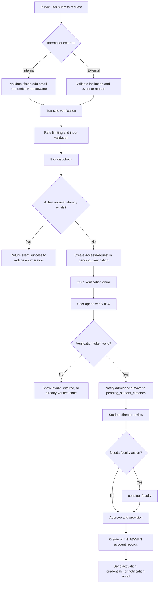
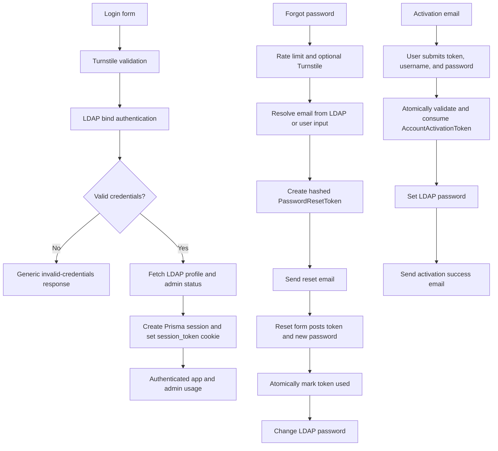
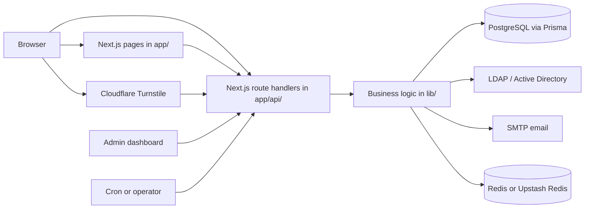

# UAR Portal

The UAR (User Access Request) Portal is a full-stack access request, account provisioning, and operations console for the Mitchell C. Hill Student Data Center and the Cal Poly Pomona student-led Security Operations Center.

This README is the canonical public reference for this repository. It is written against the current codebase in `my-app/` and is intended to be the single human-readable source of truth for what the application does, how it is structured, and how it is started.

## Table of Contents

- [At a Glance](#at-a-glance)
- [What the Portal Does](#what-the-portal-does)
- [End-to-End Workflows](#end-to-end-workflows)
- [Runtime Surface](#runtime-surface)
- [Architecture](#architecture)
- [Data Model](#data-model)
- [Security and Control Model](#security-and-control-model)
- [Technology Stack](#technology-stack)
- [Getting Started](#getting-started)
- [Environment Variables](#environment-variables)
- [Deployment and Operations](#deployment-and-operations)
- [Repository Layout](#repository-layout)
- [Maintaining This README](#maintaining-this-readme)

## At a Glance

The portal combines public intake, identity verification, LDAP-backed authentication, administrative review, account provisioning, support workflows, and operational automation in one Next.js App Router application.

The current codebase contains:

| Area | Current Count |
| --- | ---: |
| App pages | 26 |
| API route handlers | 87 |
| Admin components | 24 |
| Prisma models | 30 |

The application is not a generic demo. It expects real infrastructure:

- PostgreSQL for operational data
- LDAP / Active Directory over LDAPS for authentication and account operations
- SMTP for transactional email
- Redis or Upstash Redis for distributed rate limiting
- Cloudflare Turnstile for public-form abuse protection

## What the Portal Does

The UAR Portal manages the full access lifecycle for two main audiences:

- Internal users, primarily `@cpp.edu` users who may require Active Directory-backed access
- External users, such as visitors, event participants, or temporary users who may require time-bound access

Core responsibilities in the current codebase:

- Public request intake for internal and external access requests
- Email verification before requests enter reviewer queues
- Student director review and routing
- Faculty review and approval paths
- Active Directory account creation, linking, password operations, and expiration handling
- VPN account management, status changes, imports, and matching
- First-time account activation and password reset flows
- User profile lookup from LDAP
- Authenticated support ticket creation and response handling
- Batch account creation for multi-user operational work
- Account lifecycle scheduling and queued processing
- System settings, banners, notifications, blocklists, audit logging, and session management
- Infrastructure synchronization between existing directory/infrastructure records and portal records

## End-to-End Workflows

### Access Request Lifecycle



What the code does during submission:

- `POST /api/request` validates JSON payload size, required fields, and string lengths.
- Public submissions require a valid Cloudflare Turnstile token.
- Internal requests must use `@cpp.edu`.
- External requests must include an institution and either an event reason or one or more active event IDs.
- Selected event IDs are checked against active `Event` records.
- Blocked email addresses are rejected before a request record is created.
- Duplicate active requests are intentionally answered with a success response instead of a conflict response to reduce user enumeration.
- Verification tokens are generated for 24 hours.

Internal-request handling has additional logic:

- The email prefix is extracted and used as the expected BroncoName / username basis.
- LDAP is queried to detect a "grandfathered" account: an existing AD account without an email address already attached.
- If such an account exists, the request is marked to link to the existing account instead of creating a new one.

Verification behavior:

- `POST /api/verify/confirm?token=...` rate-limits both by IP and by token.
- Verification attempts are counted in the database.
- If admin notification succeeds, the request becomes `pending_student_directors`.
- If notification email fails, the request is marked for notification retry and the user still sees a successful verification state.

The status values explicitly observed in code are:

- `pending_verification`
- `pending_student_directors`
- `pending_faculty`
- `approved`
- `rejected`

### Authentication, Activation, and Password Recovery



Current authentication behavior from the code:

- `POST /api/auth/login` checks whether logins are globally disabled in `SystemSettings`.
- Break-glass recovery for a manual login lock follows [`docs/runbooks/manual-login-lock-recovery.md`](docs/runbooks/manual-login-lock-recovery.md) and keeps logins disabled until an authenticated administrator re-enables them.
- Enabling or canarying OIDC outage fallback follows [`docs/runbooks/oidc-outage-fallback.md`](docs/runbooks/oidc-outage-fallback.md); it remains off until every portal replica and the additive challenge-provenance migration are in place.
- Logins require Cloudflare Turnstile plus LDAP authentication.
- Admin state is not trusted solely from the session. Admin API routes re-check domain-admin membership through LDAP.
- Sessions are stored in Prisma with hashed tokens, expiry, last activity, IP address, and user agent.
- Creating a new session deletes any existing sessions for that username, so the portal enforces one active session per user.

Current session behavior:

- Session cookie name: `session_token`
- Cookie flags: `HttpOnly`, `SameSite=strict`, `secure` by default
- Default max age: 30 minutes for admins, 60 minutes for non-admin users
- Idle timeout: 15 minutes for native AD and local break-glass sessions
- `AUTH_SESSION_MAX_AGE` can override the max age for direct AD and local sessions. OIDC/SSO sessions use the shorter of the signed upstream provider-session expiry and the portal cap in `AUTH_OIDC_SESSION_MAX_AGE` (8 hours by default); their idle window follows that effective expiry.

Password reset behavior:

- Public reset requests require Turnstile when the user is not already identified by username.
- The portal returns a uniform success message even when the target account does not exist or is in an ineligible state.
- Password reset tokens are stored as SHA-256 hashes, not plaintext.
- Reset token consumption is wrapped in a serializable Prisma transaction to reduce race conditions.
- If the LDAP password-change operation fails, token usage is rolled back so the user can retry.

Account activation behavior:

- Activation tokens are also stored hashed and consumed transactionally.
- The request must already be `approved`.
- The request must belong to an internal user.
- The submitted username must match the request's stored LDAP username.
- If LDAP password-setting fails, token state is rolled back and the user receives a safe error response.

### Administrative Operations and Scheduled Processing

```mermaid
flowchart LR
  A[Admin dashboard] --> B[Requests, events, users, support, VPN, batch, settings]
  B --> C[Admin API routes]
  C --> D[(PostgreSQL via Prisma)]
  C --> E[LDAP / Active Directory]
  C --> F[SMTP notifications]
  C --> G[Audit log entries]

  H[Lifecycle queue] --> I[/api/admin/account-lifecycle/process]
  J[Cron caller] --> K[/api/cron/process-lifecycle-queue]
  I --> L[Lifecycle processor]
  K --> L
  L --> D
  L --> E
```

Operational workflows implemented in the code include:

- Request review, comments, routing, approval, rejection, resend flows, and manual assignment
- Batch account creation that validates accounts, generates usernames/passwords, provisions LDAP users, and emails credentials
- VPN account management, imports, record matching, comments, bulk status updates, and cleanup routes
- Account lifecycle queue processing for disable, enable, revoke, restore, and related actions
- Infrastructure sync from existing systems back into the portal database, including `dryRun`, latest status, history, and detail views

## Runtime Surface

### Page Inventory

The current page routes in `my-app/app` are:

| Area | Routes |
| --- | --- |
| Public landing and intake | `/`, `/request/internal`, `/request/external`, `/request/success`, `/instructions` |
| Authentication and recovery | `/login`, `/forgot-password`, `/reset-password` |
| Verification and onboarding | `/verify/confirm`, `/verify/success`, `/verify/error`, `/verify/already-verified`, `/account/welcome`, `/account/activate`, `/account/activate/expired`, `/account/reset-password` |
| User self-service | `/profile`, `/support/create`, `/support/tickets`, `/support/tickets/[id]` |
| Admin | `/admin`, `/admin/search`, `/admin/batch-accounts`, `/admin/batch-accounts/[id]`, `/admin/requests/[id]`, `/admin/support/tickets/[id]` |

### API Route Inventory

The current API surface in `my-app/app/api` is grouped below by function.

| Domain | Routes |
| --- | --- |
| Public request intake and verification | `/api/request`, `/api/verify`, `/api/verify/confirm`, `/api/events/active` |
| Authentication, session, and CSRF | `/api/auth/login`, `/api/auth/logout`, `/api/auth/session`, `/api/auth/check-admin`, `/api/csrf-token` |
| Password recovery and account activation | `/api/auth/request-password-reset`, `/api/auth/reset-password`, `/api/account/activate` |
| User profile and email verification | `/api/profile`, `/api/profile/check-records`, `/api/profile/verify-email`, `/api/profile/verify-email/confirm` |
| User support and banner data | `/api/support/tickets`, `/api/support/tickets/[id]`, `/api/support/tickets/[id]/responses`, `/api/settings/banner` |
| Scheduled processing | `/api/cron/process-lifecycle-queue`, `/api/cron/process-offboard-campaigns`, `/api/cron/process-password-expiration`, `/api/cron/process-password-cleanup` |
| Admin access request management | `/api/admin/requests`, `/api/admin/requests/[id]`, `/api/admin/requests/[id]/acknowledge`, `/api/admin/requests/[id]/approve`, `/api/admin/requests/[id]/reject`, `/api/admin/requests/[id]/comments`, `/api/admin/requests/[id]/create-account`, `/api/admin/requests/[id]/save-credentials`, `/api/admin/requests/[id]/manual-assign`, `/api/admin/requests/[id]/send-to-faculty`, `/api/admin/requests/[id]/return-to-faculty`, `/api/admin/requests/[id]/move-back`, `/api/admin/requests/[id]/resend-verification`, `/api/admin/requests/[id]/resend-activation`, `/api/admin/requests/[id]/resend-notification`, `/api/admin/requests/[id]/reset-password`, `/api/admin/requests/[id]/update-account`, `/api/admin/requests/[id]/notify-faculty`, `/api/admin/requests/[id]/undo-notify-faculty` |
| Admin directory, account search, and group management | `/api/admin/users`, `/api/admin/groups`, `/api/admin/groups/[groupName]/members`, `/api/admin/ad-search`, `/api/admin/ad-comments/[accountId]`, `/api/admin/ad-comments/comment/[id]`, `/api/admin/search`, `/api/admin/check-username`, `/api/admin/generate-password` |
| Admin VPN management and import pipeline | `/api/admin/vpn-accounts`, `/api/admin/vpn-accounts/[id]`, `/api/admin/vpn-accounts/[id]/status`, `/api/admin/vpn-accounts/[id]/comments`, `/api/admin/vpn-accounts/bulk-status`, `/api/admin/vpn-import`, `/api/admin/vpn-import/[id]`, `/api/admin/vpn-import/process`, `/api/admin/vpn-import/match`, `/api/admin/vpn-import/cleanup`, `/api/admin/vpn-import/clear` |
| Admin batch operations | `/api/admin/batch-accounts`, `/api/admin/batch-accounts/create`, `/api/admin/batch-accounts/[id]`, `/api/admin/batch-accounts/[id]/cancel`, `/api/admin/batch-accounts/cleanup` |
| Admin lifecycle and sync | `/api/admin/account-lifecycle`, `/api/admin/account-lifecycle/process`, `/api/admin/account-lifecycle/batch`, `/api/admin/account-lifecycle/[id]`, `/api/admin/account-lifecycle/[id]/retry`, `/api/admin/account-lifecycle/[id]/cancel`, `/api/admin/sync-status`, `/api/admin/settings/infrastructure-sync` |
| Admin governance and platform operations | `/api/admin/settings`, `/api/admin/notifications`, `/api/admin/notifications/[id]`, `/api/admin/blocklist`, `/api/admin/blocklist/[id]`, `/api/admin/events`, `/api/admin/events/[id]`, `/api/admin/logs`, `/api/admin/sessions`, `/api/admin/track-view`, `/api/admin/cleanup-passwords`, `/api/admin/support/tickets`, `/api/admin/logout` |

Batch cancellation and legacy-batch recovery follow [`docs/runbooks/batch-account-reconciliation.md`](docs/runbooks/batch-account-reconciliation.md). Cancellation is rejected while creation is still active and never treats ambiguous directory state as resolved.

### Admin Dashboard Modules

The main admin dashboard imports and renders these tab modules:

| Admin tab | Purpose |
| --- | --- |
| `requests` | Review, comment on, route, approve, reject, assign, and provision access requests |
| `events` | Manage external-event records used by the public external request flow |
| `users` | Inspect LDAP-backed users and group/account state |
| `support` | Review support tickets, responses, and ticket state |
| `batch` | Create and inspect batch account creation work |
| `vpn` | Manage VPN accounts, imports, matches, and state transitions |
| `blocklist` | Prevent specific email addresses from submitting new requests |
| `settings` | Manage system controls, banners, and infrastructure sync tooling |
| `logs` | Review audit and operational log output |
| `sessions` | Inspect and revoke active user sessions |
| `lifecycle` | Queue, inspect, retry, cancel, and process lifecycle actions |
| `sync-status` | Inspect match state between portal, AD, and VPN records |
| `communications` | Drive manual communication and resend flows tied to requests |

## Architecture

The application is a single Next.js App Router project under `my-app/` with both frontend and backend code in the same repository.



Current architectural characteristics:

- Frontend pages and backend APIs live in the same Next.js application.
- Prisma is used for the system-of-record database.
- LDAP / Active Directory is used for identity validation, account creation, group membership work, and password operations.
- Redis-backed rate limiting is used when `REDIS_URL` is configured; otherwise the code falls back to in-memory limits. If Redis is configured and unavailable, protected mutation routes fail closed.
- Most non-UI business logic lives in `my-app/lib/`.
- `middleware.ts` handles admin page gating, CSRF enforcement, request logging, and security headers.
- `next.config.ts` validates required environment variables at startup and build time before the app boots.

## Data Model

The Prisma schema currently defines 30 models. The main domains are:

| Domain | Models |
| --- | --- |
| Access governance | `AccessRequest`, `RequestComment`, `Event` |
| Tokenized onboarding and recovery | `PasswordResetToken`, `AccountActivationToken` |
| Support operations | `SupportTicket`, `TicketResponse`, `TicketStatusLog` |
| Batch account operations | `BatchAccountCreation`, `BatchAccountItem`, `BatchAuditLog` |
| VPN management | `VPNAccount`, `VPNAccountStatusLog`, `VPNAccountComment`, `VPNImport`, `VPNImportRecord`, `VPNRoleChange`, `VPNAccountActivityLog` |
| Sessions, settings, and governance | `Session`, `BlockedEmail`, `SystemSettings`, `NotificationBanner`, `AuditLog` |
| Lifecycle and sync | `AccountLifecycleAction`, `AccountLifecycleBatch`, `AccountLifecycleHistory`, `ADAccountSync`, `ADAccountMatch`, `ADAccountActivityLog`, `ADAccountComment` |

Key `AccessRequest` data tracked in the schema:

- Request identity and requestor metadata
- Internal vs external classification
- Event linkage and expiration data
- Verification token state and verification attempts
- Review and approval timestamps
- LDAP username, VPN username, and account password storage fields
- Provisioning status and error fields
- Manual assignment and grandfathered-account linkage
- AD and VPN lifecycle state fields such as disable, revoke, restore, and related reasons

Support ticket behavior reflected in the schema:

- Tickets belong to authenticated usernames
- Tickets can optionally reference an `AccessRequest`
- Ticket responses and ticket status changes are stored separately
- Batch account jobs can be linked back to a support ticket

Schema changes are delivered only through the checked-in migration histories in
`my-app/prisma/migrations` and `services/auth-service/prisma/migrations`. Run the
portal history first and the Auth Manager history second; do not use `prisma db
push` for installation or recovery.

## Security and Control Model

### Identity and Session Controls

- LDAP authentication is the source of truth for login.
- Admin access requires both a portal session marked as admin and a fresh LDAP admin-group check on protected admin API routes.
- Sessions are stored server-side in Prisma using hashed tokens.
- Session cookies are `HttpOnly`, `SameSite=strict`, and secure by default.
- Native AD and local break-glass sessions are invalidated after 15 minutes of inactivity. OIDC/SSO sessions remain bounded by their signed upstream provider-session expiry and the portal OIDC cap.
- New logins revoke previous sessions for the same username.

### Form, Token, and API Protections

- Public request submission, login, and public password reset flows use Cloudflare Turnstile.
- CSRF tokens are issued through `GET /api/csrf-token`.
- `middleware.ts` enforces CSRF checks on mutating requests except for explicitly exempt paths and admin `GET` routes.
- Reset and activation tokens are stored hashed and consumed transactionally.
- Duplicate request handling and password reset responses intentionally avoid revealing whether a user or request exists.
- LDAP timeout and retry behavior are configurable through environment variables. Certificate verification is enabled by default; private certificate authorities must be supplied as a base64-encoded PEM certificate through `LDAP_CA_CERT_BASE64`. `LDAP_ALLOW_INVALID_CERTS=true` is a lab-only override that disables verification while keeping the mandatory LDAPS transport; never use it where the network path is untrusted.

### Security Headers

`next.config.ts` and `middleware.ts` both contribute defense-in-depth headers, including:

- `Content-Security-Policy`
- `Strict-Transport-Security`
- `X-Frame-Options`
- `X-Content-Type-Options`
- `Referrer-Policy`
- `Permissions-Policy`
- `Cross-Origin-Embedder-Policy`
- `Cross-Origin-Opener-Policy`
- `Cross-Origin-Resource-Policy`

### Current Rate-Limit Behavior

Rate limiting is implemented in `my-app/lib/ratelimit.ts` and can run on Redis or in memory.

| Scope | Current behavior |
| --- | --- |
| Login preset | 200 requests per 15 minutes per IP |
| Request-submission preset | 200 requests per hour per IP, often with an additional identifier such as email |
| Password-reset preset | 100 requests per hour per IP, sometimes keyed by email or username |
| Verification preset | 600 requests per hour per IP |
| Admin-operation preset | 4000 requests per minute per IP, usually keyed by session ID |
| CSRF token endpoint | 100 requests per minute per IP |
| Verification token attempts | Additional 3 requests per hour per token |
| Activation attempts | Additional 5 requests per hour per IP plus username |

## Technology Stack

Versions below reflect the currently pinned dependencies in `my-app/package.json`.

| Layer | Current implementation |
| --- | --- |
| Framework | Next.js `16.0.8` |
| UI runtime | React `19.2.1` |
| Language | TypeScript `5.9.3` |
| Styling | Tailwind CSS 4, Radix UI, shadcn-style component patterns |
| Database access | Prisma `7.0.0` with PostgreSQL |
| Directory integration | `ldapts` |
| Email | `nodemailer` |
| Rate limiting / cache | `redis` and `@upstash/redis` support |
| Security helpers | `csrf-csrf`, Cloudflare Turnstile integration, bcrypt, custom session/token handling |
| Logging | Winston plus database-backed audit logging |
| Motion / UX utilities | Framer Motion, Sonner, Lucide icons |

## Getting Started

### Prerequisites

For a meaningful local, staging, or production deployment you need:

- Node.js 22.12+
- npm 10+
- PostgreSQL
- Redis or Upstash Redis
- LDAP / Active Directory reachable over LDAPS
- SMTP credentials
- Cloudflare Turnstile site and secret keys

Optional but useful:

- Docker and Docker Compose
- A scheduler that can call the lifecycle cron endpoint

### Application Root

The actual Next.js application root is `my-app/`.

Run application commands from there:

```bash
cd my-app
```

### 1. Install Dependencies

```bash
cd my-app
npm ci
```

### 2. Configure Environment Variables

For local development, put runtime variables in:

- `my-app/.env.local`, or
- your shell environment before starting Next.js

Important current behavior:

- `next.config.ts` validates environment variables during startup and build.
- The app exits early if required variables are missing or malformed.
- `DATABASE_URL` must include `sslmode=require` because that requirement is enforced in code.
- `LDAP_URL` must begin with `ldaps://`.
- `LDAP_CA_CERT_BASE64` may contain a base64-encoded PEM CA certificate when LDAP uses a private CA; otherwise the operating system trust store is used.

### 3. Prepare the Database

Use the disposable browser stack for clean-install and migration rehearsal:

```bash
cd my-app
npm run test:e2e:stack
npm run test:e2e
npm run test:e2e:stack:down
```

This uses the checked-in migration history for both Prisma projects. Do not use
`prisma db push`: it bypasses the release contract and cannot exercise the
legacy-schema safety checks.

### 4. Start the Development Server

```bash
cd my-app
npm run dev
```

Default local address:

```text
http://localhost:3000
```

### 5. Optional: Start Local PostgreSQL and Redis with Docker

If you only want the infrastructure services locally:

```bash
docker compose up -d postgres redis
```

This does not remove the need for valid LDAP, SMTP, and Turnstile configuration.

## Environment Variables

The validator-backed required variables come from `my-app/lib/env-validator.ts`. Additional operational variables below are also referenced directly in the codebase.

### Required at Startup

| Variable | Required | Notes |
| --- | --- | --- |
| `DATABASE_URL` | Yes | Must be PostgreSQL and must include `sslmode=require`. |
| `SMTP_HOST` | Yes | SMTP hostname. |
| `SMTP_PORT` | Yes | SMTP port number. |
| `SMTP_USER` | Yes | SMTP username. |
| `SMTP_PASSWORD` | Yes | SMTP password. |
| `EMAIL_FROM` | Yes | Default sender address. |
| `ADMIN_EMAIL` | Yes | Default admin notification address. |
| `LDAP_URL` | Yes | Must start with `ldaps://`. |
| `LDAP_CA_CERT_BASE64` | No | Base64-encoded PEM CA certificate for private LDAP PKI. Leave unset to use system trust. |
| `LDAP_BIND_DN` | Yes | LDAP bind DN / service account DN. |
| `LDAP_BIND_PASSWORD` | Yes | LDAP bind password. |
| `LDAP_SEARCH_BASE` | Yes | Primary LDAP search base. |
| `LDAP_DOMAIN` | Yes | Domain used for auth and account naming. |
| `LDAP_ADMIN_GROUPS` | Yes | Group list used for portal admin checks. |
| `LDAP_GROUP2ADD` | Yes | Default group used during provisioning. |
| `LDAP_KAMINO_INTERNAL_GROUP` | Yes | Required by environment validation. |
| `LDAP_KAMINO_EXTERNAL_GROUP` | Yes | Required by environment validation. |
| `LDAP_GROUPSEARCH` | Yes | Group search base used by the app. |
| `NEXT_PUBLIC_APP_URL` | Yes | Public base URL for generated links and metadata. |
| `NEXTAUTH_SECRET` | Yes | Must be at least 32 characters. |
| `ENCRYPTION_SECRET` | Yes | Must be at least 32 characters. |
| `ENCRYPTION_SALT` | Yes | Must be at least 32 characters with sufficient entropy. |
| `NEXT_PUBLIC_TURNSTILE_SITE_KEY` | Yes | Public Turnstile site key. |
| `TURNSTILE_SECRET_KEY` | Yes | Server-side Turnstile secret. |

### Additional Operational Variables Referenced in Code

| Variable | Purpose |
| --- | --- |
| `REDIS_URL` | Enables Redis-backed distributed rate limiting. |
| `REDIS_TOKEN` | Required for Upstash Redis connections. |
| `TRUST_PROXY_HEADERS` | Set to `true` only behind a trusted reverse proxy that strips inbound client IP headers and when the app port is not exposed directly. |
| `FACULTY_EMAIL` | Faculty notification target. |
| `STUDENT_DIRECTOR_EMAILS` | Student director notification targets. |
| `CRON_SECRET` | Bearer token for machine-to-machine cron endpoints. Must be at least 32 characters. |
| `PASSWORD_CLEANUP_SCHEDULER_ENABLED` | Enables the credential cleanup scheduler. Defaults to `false`. |
| `PASSWORD_CREDENTIAL_RETENTION_DAYS` | Encrypted generated-credential retention period. Defaults to 7 days; valid range is 1-30. |
| `PASSWORD_CLEANUP_INTERVAL_SECONDS` | Credential cleanup interval. Defaults to 21600 seconds (6 hours); valid range is 300-86400. |
| `PASSWORD_CLEANUP_INITIAL_DELAY_SECONDS` | Delay before the first cleanup run. Defaults to 60 seconds; valid range is 0-3600. |
| `PASSWORD_CLEANUP_HEALTH_MAX_AGE_SECONDS` | Maximum age of the last successful cleanup before the worker is unhealthy. Defaults to 86400 seconds; valid range is 600-604800. |
| `OFFBOARD_SCHEDULER_ENABLED` | Enables guarded automatic offboarding only when exactly `true`. Defaults to `false`. |
| `OFFBOARD_SCHEDULER_GRACE_SECONDS` | Maximum automatic catch-up window after scheduler downtime. Defaults to 900 seconds. |
| `PASSWORD_EXPIRATION_WARNING_DAYS` | Days before AD password expiration when portal-managed users enter the warning report. Defaults to 14. |
| `PASSWORD_EXPIRATION_SCHEDULER_ENABLED` | Enables guarded automatic password-expiration reminders only when exactly `true`. Defaults to `false`. |
| `PASSWORD_EXPIRATION_SCHEDULER_INTERVAL_SECONDS` | Compose reminder worker interval. Defaults to 21600 seconds (6 hours). |
| `PASSWORD_EXPIRATION_SCHEDULER_INITIAL_DELAY_SECONDS` | Compose reminder worker startup delay. Defaults to 45 seconds. |
| `PASSWORD_EXPIRATION_SCHEDULER_HEALTH_MAX_AGE_SECONDS` | Maximum age of the reminder worker's last successful request. Defaults to 86400 seconds. |
| `LDAP_DOMAIN_SEARCH_BASE` | Optional domain base DN for reading `maxPwdAge` if rootDSE does not expose `defaultNamingContext`. |
| `OFFBOARD_SCHEDULER_INTERVAL_SECONDS` | Compose worker interval. Defaults to 300 seconds. |
| `OFFBOARD_SCHEDULER_INITIAL_DELAY_SECONDS` | Compose worker startup delay. Defaults to 30 seconds. |
| `OFFBOARD_SCHEDULER_HEALTH_MAX_AGE_SECONDS` | Maximum age of the Compose worker's last successful request before its container becomes unhealthy. Defaults to 1200 seconds. |
| `POSTGRES_BIND_ADDRESS` | PostgreSQL host bind address. Defaults to loopback-only `127.0.0.1`. |
| `POSTGRES_PORT` | PostgreSQL host maintenance port. Defaults to 5432. |
| `REDIS_BIND_ADDRESS` | Redis host bind address. Defaults to loopback-only `127.0.0.1`. |
| `REDIS_PORT` | Redis host maintenance port. Defaults to 6379. |
| `AUTH_SESSION_MAX_AGE` | Overrides default session max age in seconds. |
| `AUTH_OIDC_SESSION_MAX_AGE` | Portal cap for OIDC/SSO-backed sessions in seconds (defaults to 28800). Actual expiry is the shorter of this cap and the signed upstream provider-session expiry. |
| `AUTH_OIDC_OUTAGE_FALLBACK` | Defaults to `off`. Explicitly setting `native_and_local` opens a short-lived Redis-backed native LDAP + `@local` circuit only after repeated internal auth-service connection failures. TLS, HTTP, metadata, callback, and token failures never open it. |
| `AUTH_ACCOUNT_LOCK_WINDOW_MS` | Shared per-account authentication lock window for the auth service and guarded native fallback. Defaults to 900000 ms. |
| `AUTH_ACCOUNT_LOCK_MAX_ATTEMPTS` | Shared failed-password threshold per account. Defaults to 5. |
| `SESSION_COOKIE_ALLOW_INSECURE` | Set to `true` only for trusted plain-HTTP deployments so session and CSRF cookies are not marked `Secure`. Keep `false` when served over HTTPS. |
| `LDAP_TIMEOUT` | LDAP timeout override in milliseconds. |
| `LDAP_MAX_RETRIES` | LDAP retry count override. |
| `LDAP_RETRY_DELAY` | Initial LDAP retry delay in milliseconds before exponential backoff. |
| `LDAP_ALLOW_INVALID_CERTS` | Lab-only override. `true` disables LDAPS certificate verification (expired/self-signed certs) while keeping encrypted transport; default `false` enforces verification. |
| `LOG_LEVEL` | Winston log level. |
| `LOG_FORMAT` | Winston log format. |
| `LOG_FILE_PATH` | Optional file-backed log output path. |
| `NODE_ENV` | Standard runtime mode. |

### Secret Generation

Generate strong random values for the major secrets:

```bash
node -e "console.log(require('crypto').randomBytes(32).toString('hex'))"
```

Use that for:

- `NEXTAUTH_SECRET`
- `ENCRYPTION_SECRET`
- `ENCRYPTION_SALT`

## Deployment and Operations

### Branch CI and release approval

`Jenkinsfile` validates source and disposable fixtures without loading deployment
credentials or connecting to a release-target database. Compose syntax uses
`.env.example`; CI images use placeholder public configuration and job/build
tags, so they are not production deployment artifacts. Backup/database
preflight, production runtime validation, migrations, and service recreation
belong to a separately authorized release process.

The browser fixture uses fixed loopback ports. Jenkins requires `flock` and
serializes that stage with `/tmp/uar-browser-test-ci.lock`; agents sharing a
Docker host must share that lock path or use separate Docker hosts. Each build
uses its own Compose project and cleans up only that project's disposable
resources. Do not point branch CI at an existing portal stack.

Development deployment configuration and setup requirements are documented in
[the HTML delivery guide](deploy/development.html). Production
promotion requires separate migration, recovery and integration validation.

### Available Scripts

Run these from `my-app/`.

| Command | Purpose |
| --- | --- |
| `npm run dev` | Start the Next.js development server |
| `npm run build` | Create a production build |
| `npm run start` | Start the production server |
| `npm run lint` | Run ESLint |
| `npm run reset-login-lock` | Run the maintenance script in `scripts/reset-login-lock.js` |

Useful Prisma commands:

```bash
npx prisma generate
npx prisma migrate deploy
```

### Dockerfile and Compose Behavior

The repository includes:

- `Dockerfile` for a standalone Next.js build
- `docker-compose.yml` with PostgreSQL, Redis, and the app service

Current runtime details from those files:

- Containers publish on parameterized host ports: portal `${APP_PORT:-4002}` (internal 3002), auth service `${AUTH_PORT:-4003}` (internal 3003).
- The Dockerfile performs `prisma generate` before `npm run build`.
- The Dockerfile injects dummy build-time values for several required variables so `next build` can run.
- Compose starts the app after PostgreSQL and Redis are healthy. It does not run schema changes.
- Compose includes an `offboard-scheduler` worker, but it remains inert while `OFFBOARD_SCHEDULER_ENABLED=false`.
- Compose includes a `password-expiration-scheduler` worker, but it remains inert while `PASSWORD_EXPIRATION_SCHEDULER_ENABLED=false`.
- Compose includes a `password-cleanup-scheduler` worker, but it remains inert while `PASSWORD_CLEANUP_SCHEDULER_ENABLED=false`. When enabled it calls the CRON-secret-protected cleanup route every six hours by default and clears terminal encrypted credentials older than seven days.
- Batch credential delivery and cleanup failures follow [`docs/runbooks/batch-credential-reconciliation.md`](docs/runbooks/batch-credential-reconciliation.md); batch results expose request IDs and provisioning states without exposing credentials.
- The optional `prisma-tool` Docker target is available for explicitly invoked schema commands.

Build the manual schema tool when needed:

```bash
docker build --target prisma-tool -t uar-prisma-tool .
```

Then run the selected Prisma command with the production database URL and network configuration supplied explicitly:

```bash
docker run --rm \
  --env DATABASE_URL="$DATABASE_URL" \
  uar-prisma-tool migrate deploy
```

For fresh installs and upgrades, use the Docker-backed migration gate instead
of invoking one project directly:

```bash
export MIGRATION_DATABASE_URL='postgresql://...'
export MIGRATION_GATE_BACKUP_DECLARATION='/restricted/backups/uar-backup.manifest'
export MIGRATION_GATE_EXPECTED_OIDC_CLIENT_COUNT=2
export MIGRATION_GATE_EXPECTED_OIDC_CLIENT_DIGEST='approved-md5-of-sorted-client-ids'
export MIGRATION_GATE_EXPECTED_SOURCE_STACK_DIGEST='approved-md5-of-source-stack-id'
export AUTH_CLIENT_SECRET_ENC_KEY='loaded-from-the-restricted-deployment-secret'
./tools/migration-gate/migration-gate.sh preflight
./tools/migration-gate/migration-gate.sh migrate
```

For the one-time recognized nonempty 34334d6 historical database with no
Prisma ledger, the separately approved command is:

```bash
export MIGRATION_GATE_APPROVE_LEGACY_BASELINE=20260507000000_legacy_schema_bootstrap
./tools/migration-gate/migration-gate.sh baseline-and-migrate
```

This path rejects empty databases, databases that already have a ledger, and
any schema outside the versioned baseline preflight's exact table, column,
index, and foreign-key fingerprints before recording the baseline. It is never selected
automatically.

`MIGRATION_GATE_BACKUP_DECLARATION` is a readable restricted manifest in the
format shown by `tools/migration-gate/backup-manifest.example`. Before any
target query or migration, the gate verifies database and asset checksums,
backup age, `pg_restore --list`, a full disposable restore, its schema
fingerprint, and an asset extraction. The gate prints only pass receipts,
migration/schema fingerprints, row counts, and the approved inventory digest.
It never prints database URLs, client IDs, secrets, or backup locations. The
expected inventory digest is `md5` of the comma-joined, sorted OIDC client IDs;
it is an integrity declaration, not a password hash.

`20260507000000_legacy_schema_bootstrap` creates the exact pre-migration May 8
schema only when `public` is empty. It no-ops only for the recognized historical
shape and fails closed for partial, unknown, or later schemas. The Jenkins
historical fixture applies that exact baseline SQL, then records only
`20260507000000_legacy_schema_bootstrap` with `migrate resolve --applied`
before normal `migrate deploy`; this prevents Prisma `P3005` without claiming
later migrations ran. Do not run that resolve sequence against an unverified
database. A database outside the recognized fingerprint requires a separately
approved baseline and forward-recovery plan.

Production schema changes remain an explicit deployment step. The gate runs
portal migrations first, then auth-service migrations, checks the Prisma
ledgers, schema fingerprints, approved row inventory, backup declaration, and
encrypted-secret decryptability before it permits a deployment to continue.

### Auth Service Sign-in Branding

The auth service renders its login interaction from per-OIDC-client branding documents stored in its own `AuthBrandingProfile` table (shared database, auth-service-owned). The service hosts its **own management console** at `{AUTH_ISSUER}/admin` — the Auth Manager — so every relying party shares one configuration surface independent of this portal:

- Sign-in requires an AD account on the `AUTH_ADMIN_USERNAMES` allowlist (unset => console 404s entirely); failed attempts reuse the interaction login rate limiter and are audited. Sessions are short-lived HMAC-signed cookies; all admin API mutations re-check the allowlist per request.
- The console editor arranges blocks (logo, heading, markdown, fixed sign-in form, divider, footer) with drag-and-drop, theme tokens, and a live preview rendered by the service itself.
- Profile resolution order at render time: client_id profile → `default` profile → built-in UAR default, with a ~30s cache.
- A token-guarded internal API (`/internal/branding/*`, secret `AUTH_INTERNAL_BRANDING_TOKEN`, compose network only) remains available for automation; `/internal/` is never proxied publicly (`docs/deploy/nginx-auth.example.conf`).
- Logo blocks take validated https URLs. Uploads may use any asset host.
- The service has checked-in migrations under `services/auth-service/prisma/migrations/`. Databases created before migration history existed need a one-time `migrate resolve --applied 20260101000000_baseline_auth_service`.

Upgrade sequence when a release touches either schema (one shared PostgreSQL database, two Prisma projects). Follow the same explicit-migration rule as the portal above; neither application runs schema changes at startup:

1. Run `./tools/migration-gate/migration-gate.sh migrate`. It validates the backup declaration and the approved, secret-free OIDC inventory before applying the portal migrations first and the auth-service migrations second. Neither application runs schema changes at startup.
2. The auth-service runner image prunes the Prisma CLI; the migration gate uses its builder stage so both projects apply their checked-in migrations through their own Prisma configuration.
3. Five auth-service migrations exist in this branch: `20260101000000_baseline_auth_service` (baseline for service-owned tables), `20260825000000_add_auth_branding_profile` (per-client sign-in branding profiles), `20260826000000_auth_service_owns_oidc_client_registry` (completes the OIDC client registry ownership transfer), `20260826120000_groups_scope_and_console_layouts` (groups scope and saved admin layouts), and `20260827000000_identity_console_product` (application directory, branding revisions, logout metadata, audit dimensions, and one-year shadow device evidence). The last migration is additive; rollback is code-first by setting `AUTH_DEVICE_RISK_MODE=off` and retaining evidence for the maintenance worker rather than dropping incident data.
4. The portal now brackets its immutable historical DROP with transfer-table renames. On an upgrade that has not yet applied the DROP, `OidcClient` and `AuthBrandingProfile` rows, including encrypted client-secret envelopes, retain their exact rows and identities. On a healthy database that already applied the DROP, the pair performs only a reversible rename and restore of the auth-service-owned tables. Rows already lost cannot be reconstructed without a pre-drop backup, so affected clients must be rotated and re-registered.
5. Portal-first then auth-service remains the supported sequence. The gate rejects inventory drift, wrong or missing client-secret encryption keys, partial schemas, and unavailable declared backups rather than attempting a speculative recovery.

### Scheduled Lifecycle Processing

Queued lifecycle work can be processed in two ways:

- Manually through `POST /api/admin/account-lifecycle/process`
- Automatically through `GET` or `POST /api/cron/process-lifecycle-queue`

Offboarding reminder dates are due timestamps, not autonomous background jobs. The
Compose `offboard-scheduler` service calls the dedicated
`/api/cron/process-offboard-campaigns` endpoint every five minutes by default.

Automatic offboarding is deliberately guarded:

- It is disabled unless `OFFBOARD_SCHEDULER_ENABLED=true`.
- The first enabled call records a Redis baseline and processes nothing.
- Later calls process only reminder or enforcement timestamps that became due after
  the previous successful call, capped by `OFFBOARD_SCHEDULER_GRACE_SECONDS`.
- Work older than that grace window remains available for explicit admin review.
- The scheduler never sends initial campaign waves.
- Reminder and enforcement categories that are paused are skipped, reported as
  paused in the scheduler result, and are not automatically replayed after resume.
- Redis locking prevents overlapping scheduler runs.
- The Compose Redis service uses append-only persistence in the `redis_data`
  volume so scheduler cursor loss is limited to roughly one second after a host
  failure.

This means deploying and enabling the scheduler does not replay an existing overdue
campaign. Existing expired `sent` recipients are still visible in the Process All
preview and are changed only if an admin explicitly selects enforcement there.

The cron route requires:

- `CRON_SECRET` to be set
- An `Authorization: Bearer <CRON_SECRET>` header

Typical dedicated offboarding invocation:

```bash
curl -X POST \
  -H "Authorization: Bearer $CRON_SECRET" \
  https://your-host.example/api/cron/process-offboard-campaigns
```

Safe production activation:

```bash
# First deploy with OFFBOARD_SCHEDULER_ENABLED=false.
docker compose up -d --build app offboard-scheduler

# After reviewing the live campaign, set a 32+ character CRON_SECRET and:
OFFBOARD_SCHEDULER_ENABLED=true docker compose up -d --force-recreate app offboard-scheduler

docker compose logs -f offboard-scheduler
```

The first authorized call after activation returns `status: "initialized"`. A later
call returns `status: "processed"` and includes the exact scheduling window used.
The worker records a heartbeat after every successful endpoint response and becomes
unhealthy when that heartbeat is stale. Connect production monitoring to:

```bash
docker inspect --format '{{.State.Health.Status}}' uar-offboard-scheduler
```

Deleting or replacing the `redis_data` volume intentionally fails safe: the next
run records a new baseline and does not replay old reminders or enforcement.
That avoids user-impacting backlog execution, but any work missed by the cursor
loss requires explicit admin review.

The cron endpoints:

- Reject unauthorized callers
- Use the guarded offboarding scheduler even when the combined lifecycle route is called
- Return scheduler status and processing summaries
- Log start and completion details

### Password Expiration Reminders

The Compose `password-expiration-scheduler` calls
`/api/cron/process-password-expiration` every six hours by default.

- It is disabled unless `PASSWORD_EXPIRATION_SCHEDULER_ENABLED=true`.
- The first enabled run immediately sends currently due reminders.
- Reminder milestones are 14, 7, 3, and 1 day before expiration, followed by a
  separate expired-password notice.
- Audit-backed reminder keys prevent repeat sends for the same password version
  and milestone. A transition from expiring to expired creates a new reminder.
- Redis locking prevents cron and admin-triggered scans from overlapping.
- Admin-selected sends use the same dedupe unless the administrator explicitly
  confirms a force resend.

```bash
docker compose up -d --build app password-expiration-scheduler

PASSWORD_EXPIRATION_SCHEDULER_ENABLED=true \
  docker compose up -d --force-recreate app password-expiration-scheduler

docker compose logs -f password-expiration-scheduler
```

### Infrastructure Sync

Infrastructure sync is exposed through `/api/admin/settings/infrastructure-sync`.

Current supported behaviors in code:

- `POST` with optional `dryRun`
- `GET` latest sync status
- `GET` sync history
- `GET` sync details by sync ID

## Repository Layout

```text
uar-web-2/
├── README.md
├── Dockerfile
├── docker-compose.yml
└── my-app/
    ├── app/               # App Router pages and API handlers
    ├── components/        # Shared UI and admin modules
    ├── hooks/             # Client hooks
    ├── lib/               # Business logic, auth, LDAP, email, security
    ├── prisma/            # Prisma schema
    ├── public/            # Static assets
    ├── scripts/           # Small maintenance scripts
    ├── middleware.ts      # Request gating, CSRF, logging, headers
    ├── next.config.ts     # Build config and env validation
    └── package.json
```

Important repository notes:

- `my-app/` is the application root.
- The repository root contains deployment and orchestration files.
- Public documentation for the project should be maintained here in `README.md` so it stays aligned with the codebase.
